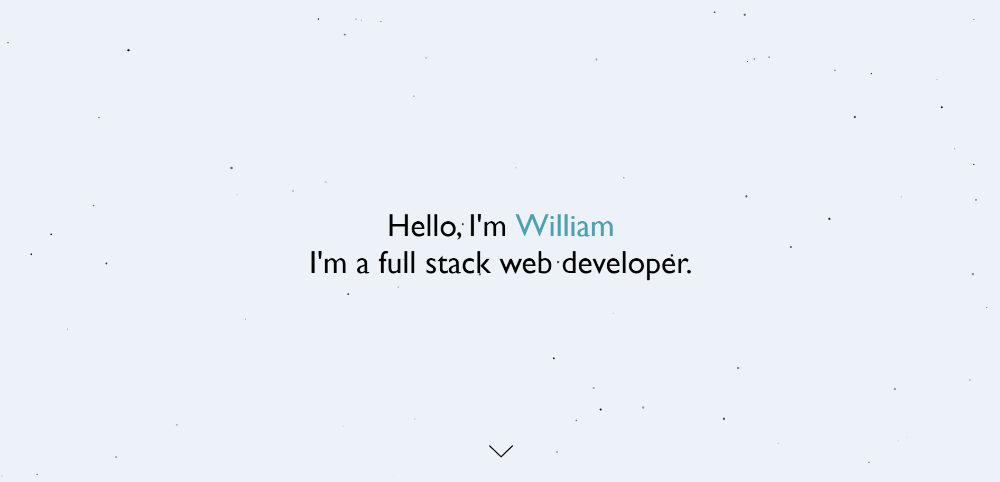
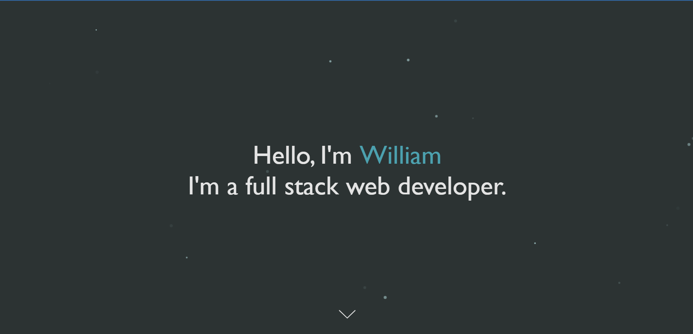

# 
# My Portfolio - A simple react portfolio app

A portfolio app made with SASS, ReactJS and ParticleJS as background. Here is where I showcase my recent completed projects. 

## Table of Contents
* [General Info](#general-information)
* [Technologies Used](#technologies-used)
* [Features](#features)
* [Preview](#preview)
* [Setup](#setup)
* [Room for Improvement](#room-for-improvement)
* [Acknowledgements](#acknowledgements)
* [Contact](#contact)

## Demo

Live demo [here](https://william-portfolio01.netlify.app)

## General Info
This is my first every completed project which I'm really proud of. I wanted to make this as simple as it could with an amazing flow towards the end of the page. 

## Technologies Used
ReactJS 18.1.0 - a front-end Javascript library used for building user interfaces for single-page applications

tsParticles - a Javscript library which allows user to create a highly customizable Javascript particle effects, confetti explosions, and fireworks animations which are mostly used as backgrounds.

SASS - an extension of CSS which gives you more power than CSS allows and to help user to clean code easily

## Feature
-Who doesn't love dark mode nowadays? You can switch into dark mode by clicking on the switch on navigation bar on the far right
-Background particle color switches two as you switch into dark mode!
-Each section flows nicely with framer-motion transition effects

## Preview

## Setup
Clone this repo to your pc and run npm install to install all dependencies to get started with the project

## Room for Improvement
Areas that could be improved in future development
-Styles 
-More particle effects 
-More cleaning in code

## Acknowledgements
[This](https://github.com/bscottnz/portfolio-site) is where I got the idea of using tsParticles as background and I would like to thank him for it!

## Contact
Feel free to contact me on my [LinkedIn](https://www.linkedin.com/in/william-cadiz/) and ask me anything. I'm a growing developer and feedbacks are like my food to get stronger and better developer!

